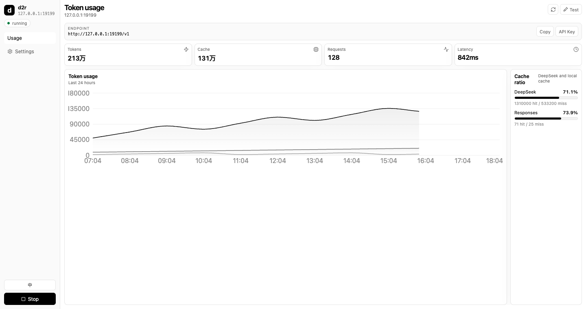

<!-- sync with README.zh.md - keep both files in sync -->

<p align="right"><a href="README.zh.md">中文</a></p>

<p align="center">
  
</p>

<h1 align="center">deepseek2responses</h1>

<p align="center">
  
  
  
  
</p>

<p align="center">
  <em>A local DeepSeek to OpenAI Responses API proxy, with an Electron dashboard for token usage and cache analytics.</em>
</p>

## Project Overview

`deepseek2responses` exposes an OpenAI Responses-compatible endpoint and forwards requests to DeepSeek Chat Completions. It is designed for Codex and other Responses API clients that need predictable local proxy behavior, tool-call conversion, reasoning passback, and `previous_response_id` support.

**Core features:**

- 🚀 **Fast local proxy**: runs on `127.0.0.1`, forwards only the normalized upstream request, and supports streaming SSE
- 🛠 **Easy to use**: first-run API key wizard, one CLI command, optional desktop dashboard
- 🔌 **Codex-compatible**: supports function tools, `local_shell`, `custom`, namespace tools, and Responses-style events
- 📦 **Focused dependencies**: Node.js 20+, Fastify, React, Electron, and small conversion modules

## Demo

<p align="center">
  
</p>

<details>
<summary><b>CLI output</b></summary>

```text
$ deepseek2responses --no-auth
deepseek2responses v0.1.0
WARNING: auth disabled (--no-auth)
Bind:     http://127.0.0.1:19199
Endpoint: http://127.0.0.1:19199/v1/responses
Dashboard: http://127.0.0.1:19199/dashboard/
```
</details>

## Installation

### Requirements

- Node.js >= 20
- macOS, Linux, or Windows
- DeepSeek API key

### Install Methods

<details open>
<summary><b>Method 1: Install from npm</b></summary>

```bash
npm install -g deepseek2responses
deepseek2responses
```
</details>

<details>
<summary><b>Method 2: Install from source</b></summary>

```bash
git clone https://github.com/Lhy723/deepseek2responses.git
cd deepseek2responses
npm install
npm run build
npm start
```
</details>

## Usage

### Quick Start

```bash
deepseek2responses
```

On first run, the CLI asks for your DeepSeek API key and saves it to `~/.deepseek2responses/config.yaml`.

Local endpoints:

```text
Proxy:     http://127.0.0.1:19199
Endpoint:  http://127.0.0.1:19199/v1/responses
Dashboard: http://127.0.0.1:19199/dashboard/
```

Desktop dashboard:

```bash
deepseek2responses --desktop
```

Local Codex testing without proxy authentication:

```bash
deepseek2responses --no-auth
```

### Core Concepts

- **Request conversion**: Responses requests are converted into DeepSeek `/v1/chat/completions` payloads.
- **Reasoning preservation**: Responses `encrypted_content` is round-tripped through DeepSeek `reasoning_content`.
- **Thinking mode**: DeepSeek V4 thinking is enabled by default. `reasoning.effort = "high"` maps to DeepSeek `"max"`; other efforts map to `"high"`.
- **Token mapping**: Responses `max_output_tokens` maps to DeepSeek `max_tokens`.
- **Conversation cache**: `previous_response_id` uses an in-memory cache when `store !== false`.
- **Tool safety**: unsupported hosted tools and `input_file` fail clearly or are dropped according to config.

### API and Config Reference

<details open>
<summary><b>Configuration options</b></summary>

| Name | Type | Default | Description |
|------|------|---------|-------------|
| `deepseek_api_key` | `string` | `""` | DeepSeek API key; also used as local proxy bearer token unless `--no-auth` is set |
| `deepseek_base_url` | `string` | `https://api.deepseek.com/v1` | DeepSeek-compatible upstream base URL |
| `host` | `string` | `127.0.0.1` | Local Fastify bind host |
| `port` | `number` | `19199` | Local proxy port |
| `timeout` | `number` | `300` | Upstream request timeout in seconds |
| `model_mapping` | `object` | DeepSeek V4 mappings | Client model to upstream model mapping |
| `max_output_tokens_cap` | `number` | `393216` | Upper bound applied before forwarding `max_output_tokens` |
| `unsupported_tools` | `"drop" \| "error"` | `drop` | How to handle unsupported hosted tools |
| `tool_name_sanitize` | `boolean` | `true` | Sanitize function and MCP tool names before upstream calls |
| `stats_file` | `string` | `~/.deepseek2responses/stats.jsonl` | Append-only request statistics file |
| `log_file` | `string` | `~/.deepseek2responses/app.log` | Diagnostic log file |

</details>

<details>
<summary><b>CLI options</b></summary>

| Command | Description |
|---------|-------------|
| `deepseek2responses` | Start the local proxy |
| `deepseek2responses --desktop` | Launch the Electron dashboard |
| `deepseek2responses --setup` | Print Codex config snippets and exit |
| `deepseek2responses --config ./config.yaml` | Use a custom config path |
| `deepseek2responses --port 19199` | Override the configured port |
| `deepseek2responses --no-auth` | Disable local proxy auth |
| `deepseek2responses --version` | Print package version |

</details>

### Advanced Usage

<details>
<summary><b>Configure Codex</b></summary>

`.codex/auth.json`:

```json
{"OPENAI_API_KEY": "sk-your-deepseek-key"}
```

`.codex/config.toml`:

```toml
model = "deepseek-v4-pro"
model_provider = "deepseek"
model_context_window = 1000000
model_max_output_tokens = 393216
model_reasoning_effort = "high"
disable_response_storage = true

[model_providers.deepseek]
name = "DeepSeek"
base_url = "http://127.0.0.1:19199/v1"
wire_api = "responses"
requires_openai_auth = true
request_max_retries = 1
```

After changing Codex config, fully quit and reopen Codex.
</details>

<details>
<summary><b>Example config file</b></summary>

```yaml
deepseek_api_key: "sk-your-key"
# deepseek_base_url: "https://api.deepseek.com/v1"
# host: "127.0.0.1"
# port: 19199
# timeout: 300
# max_output_tokens_cap: 393216
# unsupported_tools: "drop"
# tool_name_sanitize: true
# model_mapping:
#   "deepseek-v4-pro": "deepseek-v4-pro"
#   "deepseek-v4-flash": "deepseek-v4-flash"
```

Environment variables:

| Variable | Description |
|----------|-------------|
| `DEEPSEEK2RESPONSES_CONFIG` | Custom config file path |
| `DEEPSEEK_API_KEY` | Fallback API key when the config file has no key |

The config file takes precedence over `DEEPSEEK_API_KEY`.
</details>

<details>
<summary><b>Compatibility notes</b></summary>

Supported:

- `POST /v1/responses` and `/responses`
- Text input, message arrays, and `instructions`
- Non-streaming and streaming output
- `previous_response_id`
- Function tools, `local_shell`, `custom`, namespace tools, and function call outputs
- `text.format.type = "json_object"` and degraded `json_schema`
- Token usage, reasoning tokens, and DeepSeek prompt-cache token stats

Limited or unsupported:

- Hosted tools such as `file_search`, `web_search_preview`, `computer_use_preview`, `code_interpreter`, and `image_generation`
- `input_file` and image `file_id`
- Full response management endpoints such as GET, DELETE, and CANCEL
</details>

## Local Development

```bash
git clone https://github.com/Lhy723/deepseek2responses.git
cd deepseek2responses

npm install
npm run dev -- --config config.yaml --port 19199
npm test
npm run typecheck
npm run build
```

Desktop development:

```bash
npm run dev:desktop
```

## License

This project is open source under the [MIT License](./LICENSE).

## Star History

[](https://star-history.com/#Lhy723/deepseek2responses&Date)

<p align="center">
  <sub>Built with love by <a href="https://github.com/Lhy723">Lhy723</a></sub>
</p>
